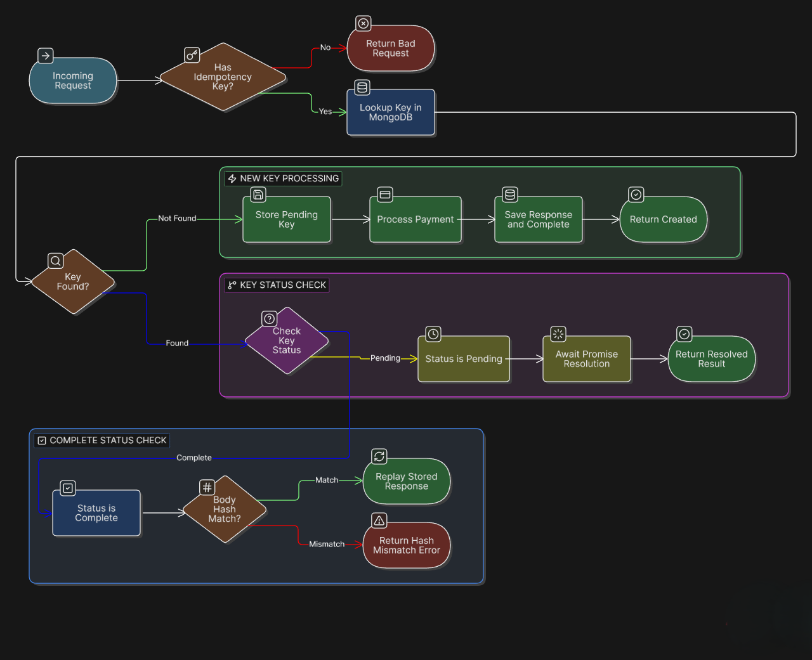

# Idempotency-Gateway (The "Pay-Once" Protocol)

A Node.js/Express-based gateway demonstrating how to implement idempotent API requests to prevent duplicate processing. This is especially critical for financial transactions or any operation where executing it multiple times could result in negative side effects.

---

## 1. Architecture Diagram

Below is the flowchart illustrating the decision process the gateway follows when a request with an idempotency key is received to ensure payments are processed exactly once.



---

## 2. Setup Instructions

### Prerequisites
- Node.js (v18 or higher)
- MongoDB instance

### Installation
1. Clone your fork of the repository:
   ```bash
   git clone https://github.com/officiallykbk/Idempotency-Gateway.git
   cd Idempotency-Gateway
   ```
2. Install dependencies:
   ```bash
   npm install
   ```
3. Set up your environment variables. Create a `.env` file in the root directory:
   ```env
   PORT=3000
   DATABASE_URL=mongodb://localhost:27017/idempotency
   ```

### Running the Application
- **Development Mode:**
  ```bash
  npm run dev
  ```
- **Production Build & Start:**
  ```bash
  npm run build
  npm start
  ```
- **Run Tests:**
  ```bash
  npm test
  ```

---

## 3. API Documentation

We utilize Swagger for interactive API documentation. When the server is running, navigate to `localhost:3000/api-docs` or `localhost:3000/api-reference` or refer to the `src/docs/main.yaml` file.

### Base URL
`http://localhost:3000`

### Endpoints

#### 1. Process Payment
Simulates processing a payment.

- **URL:** `/api/process-payment`
- **Method:** `POST`
- **Headers:**
  - `Idempotency-Key` (Required): A unique string identifying the transaction.
- **Request Body (JSON):**
  ```json
  {
    "amount": 100,
    "currency": "GHS"
  }
  ```
- **Success Responses:**
  - **Code:** `201 Created`
  - **Body:**
    ```json
    {
      "message": "Charged 100 GHS",
      "transactionId": "txn_a1b2c3d4e5f6",
      "processedAt": "2026-06-16T12:00:00.000Z"
    }
    ```
  - **Header (On Replay):** `Idempotency-Key-Used: true`
- **Error Responses:**
  - `400 Bad Request`: Missing header or invalid body.
  - `409 Conflict`: Payment is currently in flight (processing).
  - `422 Unprocessable Entity`: The same `Idempotency-Key` was used with a different request body.
  - `500 Internal Server Error`: Server-side processing failure.

#### 2. Health Check
- **URL:** `/health`
- **Method:** `GET`
- **Response:** `200 OK` `{"message": "Server is running"}`

---

## 4. Design Decisions

- **Middleware Pattern:** The idempotency logic is decoupled into its own Express middleware (`src/middleware/idempotency.ts`). This allows the controller to focus purely on business logic (payment simulation) without being cluttered by caching concerns.
- **MongoDB for State:** We use MongoDB to persist the idempotency records. This allows the gateway to scale horizontally across multiple instances, sharing a single source of truth for processed keys.
- **Payload Hashing:** To detect payload mismatches (User Story 3), we compute a SHA-256 hash of the request body and store it alongside the key.
- **In-Flight Polling:** To handle race conditions (Bonus User Story 6), if a request arrives and the state is `PROCESSING`, the middleware polls the database with a short delay (`WAIT_INTERVAL_MS`) until the state changes to `COMPLETED`, rather than rejecting it outright.

---

## 5. The Developer's Choice

**Feature Added:** Standardized Release & Semantic Versioning Automation
**Why:** In a real-world Fintech company, knowing exactly what changed between deployments is critical for compliance, auditing, and rollback strategies. 

I implemented a release pipeline using `standard-release` (built on Release It!). This tool automatically parses conventional commits (e.g., `feat:`, `fix:`, `docs:`), bumps the semantic version in `package.json`, generates a changelog, and tags the git history. 

This ensures that every artifact deployed to production has a traceable, immutable history, reducing human error during the release process.
